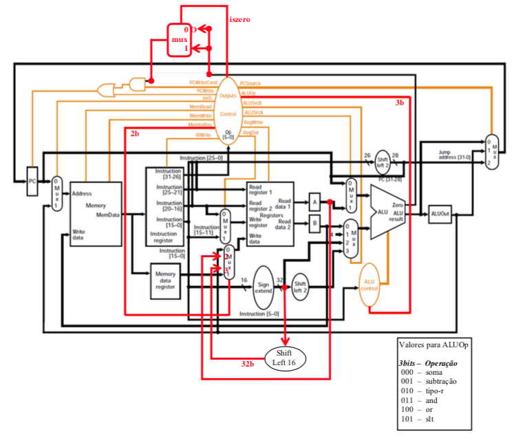
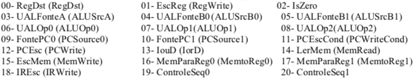

# 32 bit MIPS multi-cycle CPU (C language)

OVERVIEW
--------------------------------------------------
This is an implementation of a 32 bit MIPS multi-cycle CPU for the [Computer Organization and Design] course. It was made at the Computer Science undergraduate program from University of São Paulo (ICMC - USP).



PROJECT
--------------------------------------------------
The purpose of this project was to implement a 32 bits MIPS multi-cycle CPU based on the Hennessy and Patterson (Computer Organization and Design) book.
The implemented instructions are: `add`, `sub`, `slt`, `and`, `or`, `lw`, `sw`, `beq`, `j`, `lui`, `ori`, `andi`, `slti`, `bltz`, `bne`, `move`.

SPECIFICATIONS
--------------------------------------------------
The Control Unity should be implemented as a microprogrammed control, as described in the classes. Thus, there must be a microcode for the initial representation, a microprogramme counter + dispatch tables for the sequencing control, true tables for the representation in the level of digital logic and memories ROMs for the implementation technique. This ROM should be represented in your code as an integer vector.
The control signals issued by the UC will be represented in its code as bits of an integer variable (32 bits). The order of the control bits in this 32-bit variable is as follows:

The implementation of the work must use these control signals in this order. Changes in the
data path of the MIPS Multicycle CPU architecture, so that the new instructions can be implemented, are already in the block diagram of the attached figure (highlighted in red). This data path can not be changed either. Again, any error / doubt / difficulty checked in the given data path, contact the teacher directly so that the issue is resolved properly.
The new instructions lui, ori, andi, slti, bltz and bne are specified in the Patterson & Hennessy Organization book (1998 or 2005). The new instruction moves (before a pseudo-instruction) will now have the Type-I format and the operation code 0x3F. This instruction moves rt, rs has the following semantics: rt = rs. Outside opcode, rs and rt, the remaining fields of the instruction have a value of zero.
The number of cycles spent in executing the new instructions is: lui / bltz / bne / move 3 cycles and ori / andi / slti 4 cycles.

HOW TO COMPILE
--------------------------------------------------
```bash
  1. Clone repository: https://github.com/wesjrock/mipscpu.git
  2. gcc cpu_mips_multiciclo_2014.c -o <executable_name>
```

MORE INFO
--------------------------------------------------
You can find more information about the project in the files:  `task specification.pdf` and `assignment report`.
* HENNESSY, PATTERSON, Computer Organization and Design MIPS Edition: The Hardware/Software Interface, 2005.
